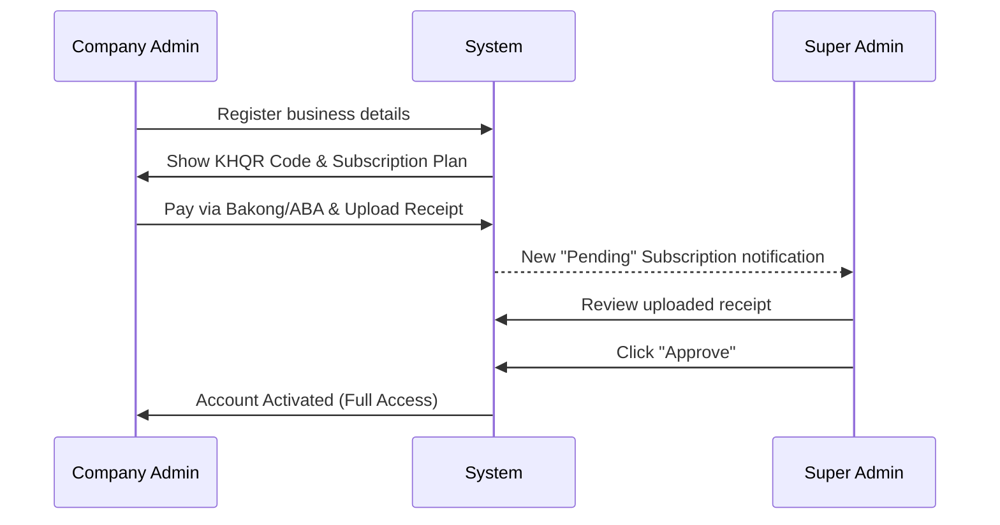
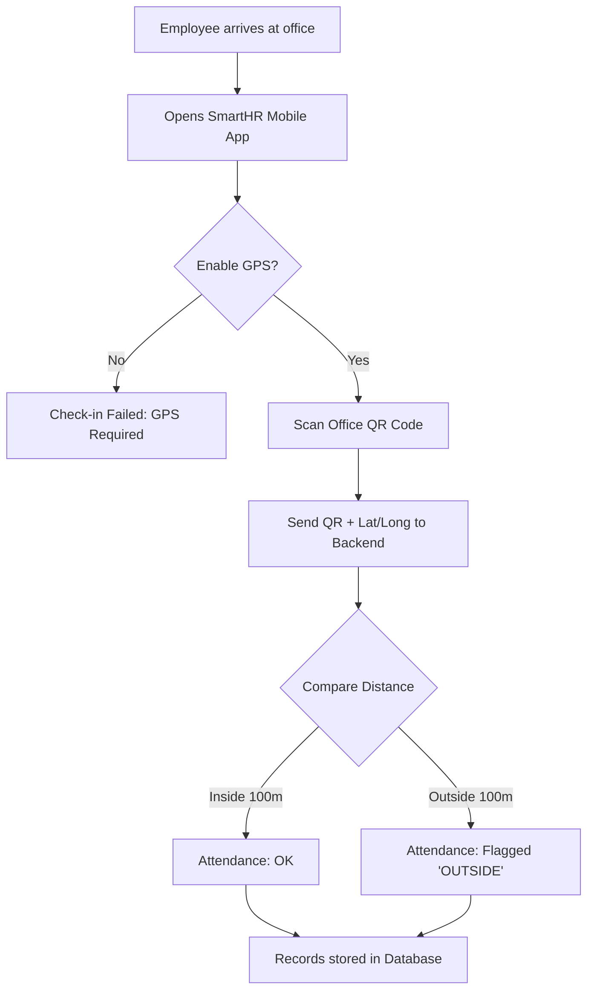

# SmartHR User Process Flows

This document details the step-by-step operational workflows for the different user roles in SmartHR.

---

## 🏗️ 1. Company Onboarding & Activation Flow
This is the process of a new business joining the platform.

**Step-by-Step:**
1.  **Sign Up**: The Manager enters the company name, email, and password.
2.  **Payment Screen**: The system immediately shows a KHQR (Bakong) code.
3.  **Transfer**: The Manager scans with their banking app, pays, and takes a screenshot.
4.  **Evidence**: They upload the screenshot back into the "Receipt" box on the portal.
5.  **Verification**: The Super Admin checks their bank account. If correct, they mark the status as "Active".

---

## 📍 2. Daily Attendance Flow (GPS + QR)
This happens every day when employees arrive at work.

**Key Highlights:**
- **GPS Enforcement**: The app *must* have location permissions enabled to prevent check-ins from remote locations.
- **Geofence Check**: If the system detects the employee is too far from the coordinates set by the Manager, it will still allow the scan but will alert HR with a warning icon.

---

## 💰 3. Monthly Payroll Flow (Dual-Currency)
This happens at the end of every month.

**1. Configuration (One-time):**
- Manager sets the **Base Currency** (e.g., USD).
- Manager sets the **Exchange Rate** (e.g., 1 USD = 4100 KHR).

**2. Execution:**
- Manager clicks **"Generate Payroll"**.
- System calculates the total amount in USD based on attendance and leave.
- System automatically applies the formula: `Amount_KHR = Amount_USD * ExchangeRate`.

**3. Delivery:**
- Manager reviews the list where both currencies are shown side-by-side.
- Manager clicks **"Publish"**.
- Employee gets a notification and opens their app to see their payslip in both Dollar and Riel.

---

## 📋 4. Employee Leave Request Flow
How staff take days off.

1.  **Request**: Employee selects dates and reason (e.g., "Sick Leave").
2.  **Attachment**: Employee takes a photo of their medical note/invite via mobile app.
3.  **Notification**: Manager sees a blue notification on their dashboard.
4.  **Action**: Manager clicks "Approve" (records updated) or "Reject" (notifies employee).
